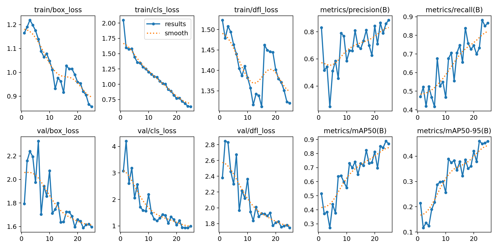

# FireGuard Machine Learning AI

Fireguard is a machine learning Artificial Intelligent trained with Yolov8 to detect **Fire** and **Smokes** from pictures.

For this project you have two options:
* Use pre-trained model in release, check **Model**
* Train model by yourself, check **Train**

## Table of Contents
1. [Model](#model)
2. [Train](#todel)


--------------------------

## Model

If you want to use the model directly without training your own model, download the `FireGuardBestModel.pt` or `FireGuardLastModel.pt` from [release](https://github.com/ZhengLinLei/FireGuardML/releases/)

### Usage
```python
import cv2
from ultralytics import YOLO
import math
import os

# Cargar el modelo
model = YOLO('./FireGuardBestModel.pt')

# Leer las clases
classnames = ['fire', 'smoke', 'neutral']

# Crear un directorio para guardar las imágenes procesadas
os.makedirs('../tmp', exist_ok=True)

# Lista de imágenes a procesar
# Coger las imagenes de ./img sin . .. y otros que no sean .jpg
images = [img for img in os.listdir('../img') if img.endswith('.jpg')]

for image_path in images:
    # Leer la imagen
    frame = cv2.imread(f'../img/{image_path}')
    frame = cv2.resize(frame, (640, 480))

    # Procesar la imagen con YOLO
    result = model(frame, stream=True)
    # Get confidence and class names
    # print(result[0])

    # Obtener la información de bbox, confianza y nombres de clases para trabajar con ella
    for info in result:
        boxes = info.boxes
        for box in boxes:
            confidence = box.conf[0]
            confidence = math.ceil(confidence * 100)
            Class = int(box.cls[0])
            if confidence > 10:
                x1, y1, x2, y2 = box.xyxy[0]
                x1, y1, x2, y2 = int(x1), int(y1), int(x2), int(y2)
                print(f'Class: {classnames[Class]}, Confidence: {confidence}%')
                cv2.rectangle(frame, (x1, y1), (x2, y2), (0, 0, 255), 2)
                # Write the class name and confidence
                cv2.putText(frame, f'{classnames[Class]} {confidence}%', (x1 - 8, y1 - 8), cv2.FONT_HERSHEY_SIMPLEX, 0.7, (0, 0, 255), 1)


                # Guardar la imagen procesada
                processed_image_path = os.path.join('../tmp', os.path.basename(image_path))
                cv2.imwrite(processed_image_path, frame)
```


--------------------------


## Train

If you have enough time or you want to include custom data to train your own AI model, you can choose from
1. Train in Google colab (recommended)
2. Train in your machine

You can find the datasets from [release](https://github.com/ZhengLinLei/FireGuardML/releases/)


### Google colab

#### Dowload dataset and import to drive

To train the model in Google colab, be sure to have the datasets installed and uploaded to your Google drive with this name `~/D-Fire-datasets`. And check if you have this file branch

```
📁 D-Fire-datasets
    |
    \-----> 📁 fire
                 |
                 |----> 📁 test
                 |         |
                 |         |---> 📁 images (images)
                 |         \---> 📁 labels (txt)
                 |
                 |----> 📁 train
                 |         |
                 |         |---> 📁 images (images)
                 |         |---> 📁 labels (txt)
                 |         \---> 📄 labels.cache
                 |
                 |----> 📁 train
                 |         |
                 |         |---> 📁 images (images)
                 |         |---> 📁 labels (txt)
                 |         \---> 📄 labels.cache
                 |
                 \---> 📄 data.yaml
                 
```

### Download Colab file 

Donwload the source file from `./src/FireGuardML_Train.ipynb` and import it to google colab. **Be sure to enable GPU**


-------

### Own Machine

#### Installation
Go to `src/` and install dependecies

```bash
python3 -m pip install -r requirements.txt
```

#### Download datasets

Down load the dataset from [release](https://github.com/ZhengLinLei/FireGuardML/releases/) and decompress it inside `./data` folder


#### Usage

To train the model, execute the file `./src/setup.sh` inside `./src/context`

```bash
cd src
./setup.sh
```


----------------------------------------------------------------------------


## Information




 <p xmlns:cc="http://creativecommons.org/ns#" xmlns:dct="http://purl.org/dc/terms/"><a property="dct:title" rel="cc:attributionURL" href="https://github.com/ZhengLinLei/FireGuardML">FireGuardML</a> by <a rel="cc:attributionURL dct:creator" property="cc:attributionName" href="https://github.com/ZhengLinLei">Zheng Lin Lei</a> is licensed under <a href="http://creativecommons.org/licenses/by-nc/4.0/?ref=chooser-v1" target="_blank" rel="license noopener noreferrer" style="display:inline-block;">CC BY-NC 4.0</a></p> 